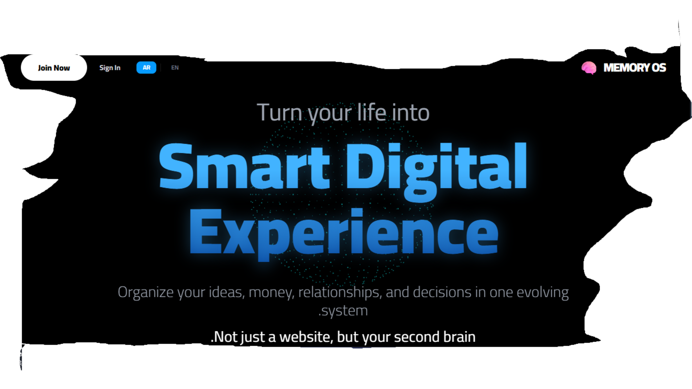

  <!-- الرجاء حفظ الصورة التي أعطيتني إياها باسم cover.png داخل مجلد public في المشروع -->
  
  
   
  <h1>🧠 Personal Memory OS</h1>
  
<b>Your Smart Digital Experience & Second Brain</b>

  
<i>ليس مجرد موقع، بل هو عقلك الثاني المُعزز بالذكاء الاصطناعي</i>

  

    
    
    
    
    
  

---

## 🚀 عن المشروع (About The Project)

**Personal Memory OS** هو نظام لإدارة الحياة الشخصية تم تصميمه ليكون بمثابة "عقل موازٍ". يدمج بين إدارة المهام، تحليل القرارات، الميزانية، وتتبع العلاقات الشخصية في بيئة رقمية واحدة مدعومة بالكامل بالذكاء الاصطناعي (AI).

الهدف الأساسي من المشروع هو تحويل حياتك المبعثرة إلى **تجربة رقمية ذكية** بتصميم راقٍ وفخم (Premium Dark Mode & Glassmorphism).

---

## ✨ المميزات الأساسية (Core Features)

### 💡 مختبر الأفكار (Idea Lab)

مكان آمن لتسجيل أفكارك العابرة. سيقوم المساعد الذكي بتحليل فكرتك، إعطائك رأيه فيها، واقتراح خطة لتطويرها واقعياً.

### 💰 المستشار المالي (Smart Budget & Money)

تتبع إيراداتك ومصروفاتك بذكاء. الذكاء الاصطناعي يحلل تسرب الأموال ويعطيك نصائح مخصصة بناءً على سلوكك المالي لتوفير ميزانيتك.

### ⚖️ مساعد القرارات (Decision Advisor)

عندما تقع في حيرة من أمرك (وظيفة جديدة، تعلم مهارة، قرار مصيري)، اكتب مشكلتك هنا. سيقوم النظام بدراسة الخيارات وإعطائك الموازنة الإيجابية والسلبية ومساعدتك في حسم القرار.

### 🤝 دليل العلاقات (Social Hub & CRM)

نظام لتتبع علاقاتك المهمة (العائلة، الأصدقاء، الزملاء). يسجل تواريخ تواصلك، ملاحظات وهدايا مفضلة، ويذكرك بمن ابتعدت عنهم لتبقى ذو أثر طيب.

### 🌍 ثنائية اللغة (Arabic/English)

يدعم النظام اللغتين العربية والإنجليزية بالكامل مع دعم التبديل الديناميكي المستجيب للاتجاهات (RTL / LTR). الذكاء الاصطناعي داخل النظام سيتحدث معك وبنفس لغة واجهتك المختارة!

---

## 🛠️ التقنيات المستخدمة (Tech Stack)

تم بناء هذا النظام باستخدام مزيج من أحدث تقنيات الويب العالمية:

- **الواجهة الخلفية (Backend):** Laravel (PHP 8.2) مع قاعدة بيانات MySQL.
- **الواجهة الأمامية (Frontend):** Vue 3 (Composition API) مع Inertia.js لتجربة SPA سريعة.
- **التصميم (Styling):** Tailwind CSS v3 بتخصيصات متقدمة لدعم الـ Glassmorphism و الـ Dark Mode.
- **ثلاثي الأبعاد (3D WebGL):** `Three.js` لبناء خلفية سينمائية تفاعلية.
- **الذكاء الاصطناعي (AI):** متصل بمكتبة `Pollinations AI` لتقديم استشارات فورية ومجانية.
- **الترجمة (I18n):** حزمة `laravel-vue-i18n` للترجمة الفورية.

---

## 🎨 فلسفة التصميم (Design Philosophy)

اعتمدنا في هذا المشروع على تصميم **Bento Grid** العصري، مع خلفية **Deep Focus** داكنة.
تم اختيار تدرجات زرقاء ملكية (Royal Blue) ومؤثرات زجاجية شبه شفافة ليعطي انطباعاً بأن المستخدم يجلس في قمرة قيادة متطورة تدير حياته بذكاء.

---

 

  
صُنع بشغف 💙 ليكون عقلك القادم

